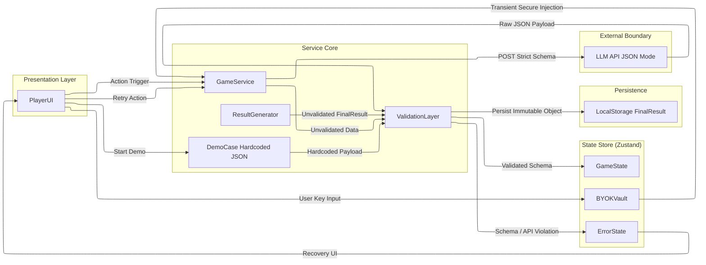

# The Bench

A client-side judge simulation game. You are the judge in a California criminal court. A case lands on your desk. You make decisions regarding pleas, rule on evidentiary motions, and hand down sentences according to the statutes as charged. Powered by your own Gemini API key or a hardcoded demo case.

This is a single-page React application deployed to GitHub Pages. Zero backend. Zero server-side secrets. The architecture forces a non-deterministic LLM into a deterministic state machine using strict JSON schemas and Zod validation.

## Why This Exists

This is my first portfolio project as I transition from the Service Desk to AI Systems Architecture. I chose to do this because I have always had an interest in the criminal legal system. This project was born from countless hours of listening to actual court proceedings, researching different perspectives of the legal system, brainstorming with family/friends and AI, as well as a desire to take a complex system and to create some form of it while demonstrating the skills I have been learning over the past couple of years. I am building it in public using AI tools, mainly Cursor, but with an abundance of thought, planning, consideration, and passion injected as well. The commit history is the real documentation of the process. This was NOT "vibe" coded. I believe the best results come from collaborating with AI, leaving the decisions to the human, not the AI. This repo proves that.

## Tech Stack

- Vite + React 18 + TypeScript (strict)
- Zustand (state management)
- Zod (validation gatekeeper)
- Tailwind CSS (presentation layer only)
- GitHub Pages (static hosting)

## Architecture

### Trust Boundaries & Data Flow

### Game State Machine and Generation Pipeline

```mermaid
%%{init:{'flowchart':{'defaultRenderer':'elk'}}}%%
flowchart LR
    subgraph GameService["GameService"]
        GS[Orchestrator]
    end

    subgraph GenPipeline["Generation Pipeline"]
        STAT[StatuteSelection]
        ENV[EnvironmentGen]
        CHAR[CharacterGen]
        EVID[EvidenceGen]
    end

    subgraph GamePhases["Game Phases"]
        WEL[Welcome]
        A1["Act1 Intake and Plea"]
        A2["Act2 Evidentiary Motions"]
        A3["Act3 Verdict and Sentencing"]
        END[EndState Aftermath]
    end

    WEL -->|"Initialize Game"| GS
    GS -->|"Trigger Pipeline"| STAT
    STAT -->|"Tier Law Context"| ENV
    ENV -->|"Physical Context"| CHAR
    CHAR -->|"OCEAN + Background"| EVID
    EVID -->|"Complete Case Payload"| A1
    A1 -->|"Trial Forced"| A2
    A1 -->|"Plea Deal Accepted"| A3
    A2 -->|"Admissibility Decided"| A3
    A3 -->|"Penalty Modifiers Applied"| END
    END -->|"Trigger Final Snapshot"| GS
```

## Status

Scaffolding in progress. The Vite + Zustand foundation is being laid now.

## License

MIT