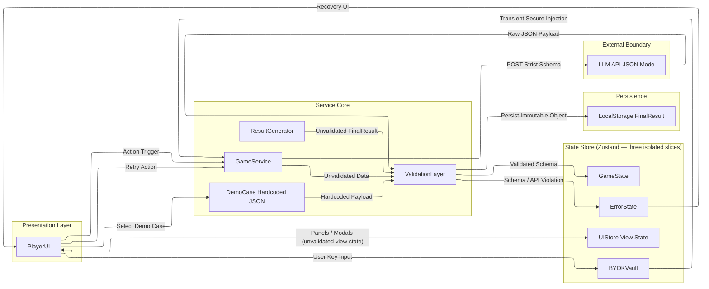

# The Bench

A client-side judge simulation game. You are the judge in a California criminal court. A case lands on your desk. You make decisions regarding pleas, rule on evidentiary motions, and hand down sentences according to the statutes as charged. Powered by your own Gemini API key or a hardcoded demo case.

This is a single-page React application deployed to GitHub Pages. Zero backend. Zero server-side secrets. The architecture forces a non-deterministic LLM into a deterministic state machine using strict JSON schemas and Zod validation.

## Why This Exists

This is my first portfolio project as I transition from the Service Desk to AI Systems Architecture. I chose to do this because I have always had an interest in the criminal legal system. This project was born from countless hours of listening to actual court proceedings, researching different perspectives of the legal system, brainstorming with family/friends and AI, as well as a desire to take a complex system and to create some form of it while demonstrating the skills I have been learning over the past couple of years. I am building it in public using AI tools, mainly Cursor, but with an abundance of thought, planning, consideration, and passion injected as well. The commit history is the real documentation of the process. This was NOT "vibe" coded. I believe the best results come from collaborating with AI, leaving the decisions to the human, not the AI. This repo proves that.

## Tech Stack

- Vite + React 19 + TypeScript (strict)
- Zustand (state management)
- Zod (validation gatekeeper)
- Tailwind CSS (presentation layer only)
- GitHub Pages (static hosting)

## Architecture

### Trust Boundaries & Data Flow

```mermaid
%%{init:{'flowchart':{'defaultRenderer':'elk'}}}%%
flowchart LR
    subgraph Presentation["Presentation Layer"]
        UI[PlayerUI]
    end

    subgraph ServiceCore["Service Core"]
        GS[GameService]
        RG[ResultGenerator]
        VL[ValidationLayer]
        DEMO[DemoCase Hardcoded JSON]
    end

    subgraph StateStore["State Store (Zustand — three isolated slices)"]
        GAME[GameState]
        ERR[ErrorState]
        VAULT[BYOKVault]
        UIS[UIStore View State]
    end

    subgraph Persistence["Persistence"]
        LS[LocalStorage FinalResult]
    end

    subgraph External["External Boundary"]
        LLM[LLM API JSON Mode]
    end

    UI -->|"Action Trigger"| GS
    UI -->|"User Key Input"| VAULT
    UI -->|"Select Demo Case"| DEMO
    VAULT -->|"Transient Secure Injection"| GS
    GS -->|"POST Strict Schema"| LLM
    DEMO -->|"Hardcoded Payload"| VL
    LLM -->|"Raw JSON Payload"| VL
    GS -->|"Unvalidated Data"| VL
    RG -->|"Unvalidated FinalResult"| VL
    VL -->|"Validated Schema"| GAME
    VL -->|"Schema / API Violation"| ERR
    VL -->|"Persist Immutable Object"| LS
    ERR -->|"Recovery UI"| UI
    UI -->|"Retry Action"| GS
    UI <-->|"Panels / Modals (unvalidated view state)"| UIS
```

### Game State Machine and Generation Pipeline

```mermaid
%%{init:{'flowchart':{'defaultRenderer':'elk'}}}%%
flowchart LR
    subgraph GameService["GameService"]
        GS[Orchestrator]
    end

    subgraph GenPipeline["Generation Pipeline"]
        STAT[StatuteSelection]
        ENV[EnvironmentGen]
        CHAR[CharacterGen]
        INTG[InterrogationGen]
        EVID[EvidenceGen]
    end

    subgraph Deterministic["Deterministic Derivations (no LLM)"]
        PLEA["buildPleaPosture (plea structure)"]
        INTP["deriveInterrogationProfile (OCEAN + priors → interview outcome + suppression ground)"]
        DEM["describeDemeanor (OCEAN → probation demeanor notes)"]
        EXPO["deriveSentencingExposure (per-charge ranges → case exposure)"]
        MOD["sentencingModifierFromRulings (Act 2 → Act 3)"]
        SCRIPT["buildCourtroomScript (statement + decision beats; spokenJudgeLines voice record; choice-keyed reaction beats)"]
        REVEAL["deriveRevealState (revealed transcript → disclosure tiers)"]
    end

    subgraph ViewState["View State (useUIStore, unvalidated)"]
        CURSOR["beatCursor (forward-only reveal)"]
    end

    subgraph GamePhases["Game Phases"]
        WEL[Welcome]
        A1["Act1 Intake and Plea"]
        A2["Act2 Evidentiary Motions"]
        A3["Act3 Verdict and Sentencing"]
        END[EndState Aftermath]
    end

    WEL -->|"Initialize Game"| GS
    GS -->|"Trigger Pipeline"| STAT
    STAT -->|"Tier Law Context"| ENV
    ENV -->|"Physical Context"| CHAR
    CHAR -->|"OCEAN + Background"| INTG
    INTP -->|"Outcome + challenge ground (echo-validated)"| INTG
    INTG -->|"Interview transcript"| EVID
    EVID -->|"Complete Case Payload + Plea Narrative (color only)"| PLEA
    DEM -->|"Demeanor notes (traits stay invisible)"| A3
    SCRIPT --> REVEAL
    REVEAL -->|"DISCLOSED / PRESENTED gating"| UI2["Panels + Detail Modals"]
    PLEA -->|"Offer / No-Offer / Rejected"| A1
    A1 -->|"Trial Forced"| A2
    A1 -->|"Plea Deal Accepted"| A3
    A2 -->|"Rulings"| MOD
    MOD -->|"Admitted-Evidence Weight"| A3
    EXPO -->|"Statutory Floor and Ceiling"| A3
    A3 -->|"Sentence Entered"| END
    END -->|"Trigger Final Snapshot"| GS
    SCRIPT -->|"Ordered beats, truncated at first unresolved decision"| CURSOR
    CURSOR -->|"Reveal one beat at a time"| GamePhases
```

The LLM provides color; deterministic code provides structure. Plea structure, case-level sentencing exposure (aggregated from per-charge statutory ranges), and the Act 2 → Act 3 penalty modifier are all pure functions of validated data — the LLM's only plea contribution is narrative strings (rationales, arguments, testimony, allocution).

The case plays out **one beat at a time**: `buildCourtroomScript` projects validated state into an ordered screenplay of speaker-attributed statements and decision points, truncated at the first unresolved decision (no spoilers) and prefix-stable (resolving a decision never rewrites the past). A reveal cursor in the view-state slice paces the courtroom — the prosecutor offers each exhibit, the defense objects or waives, witnesses testify, and the judge rules from the bench at every pause. The judge's rulings are *voiced*: each decision point presents authored bench lines bound to the closed decision enums (variants multiply voice, never the state space), the chosen words enter the record verbatim, and the courtroom reacts in character to every ruling. The record itself reads as a spoken transcript — every line led by the party speaking (witnesses and the allocuting defendant by name), each party in its own accent, with the court's rulings and the press aftermath set apart from the flowing testimony.

Act 1 follows real procedure: the clerk performs only the call and the charges, the defense enters the not-guilty plea, the People state the facts, and both sides disclose their exhibits and witnesses before any plea offer lands. What the judge can browse follows the record — the panels and detail modals are gated by a derived reveal state (`DISCLOSED` at discovery with counsel's brief unverified summary, `PRESENTED` with full detail once the item is offered or the witness sworn), and any transcript line that presents an item clicks through to its detail view. Police interrogations are *simulated at generation time*: a pure function of the defendant's OCEAN traits and priors decides what the interview room produced (confession, partial admission, denial, or lawyering up — in which case no tape exists) and which ground the defense attacks it on; the authored transcript dramatizes exactly that structure, and the tape is played into the record line by line before the suppression ruling. The traits themselves are never displayed — at sentencing the judge reads a derived probation demeanor note instead.

## Status

Foundation, UI layer, the beat-by-beat courtroom loop, and the courtroom-realism overhaul complete. Schemas, state machine, security vault, deterministic plea/sentencing/interrogation/demeanor derivations, and the full game shell (progressively revealed panels, tiered detail modals, transcript click-through) are implemented — and the game now plays as a living courtroom: arraignment and discovery precede the plea, the record unfolds one statement at a time behind a click-to-advance cursor, exhibits are offered, argued, and ruled on individually (recorded interrogations played line by line before the suppression fight), witnesses take the stand for direct and cross, closings precede per-charge verdicts, and defendants allocute before sentencing on the plea path. Five hardcoded demo cases — **People v. Eli Navarro** (the guided tutorial), **People v. Marcus Webb** (MODERATE offer), **People v. Curtis Boone** (WEAK/no offer), **People v. Dominic Reyes** (STRONG/rejected), and **People v. Teresa Vaughn** (multi-charge, split-verdict) — are playable end-to-end on every branch. Next up: `GameService` and the five-stage LLM generation pipeline (the BYOK path), then `ResultGenerator` with localStorage persistence.

## License

MIT